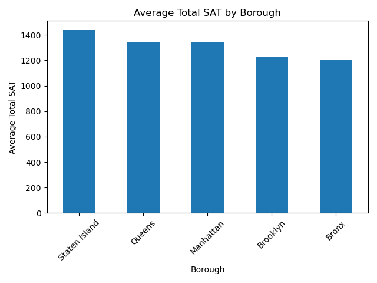
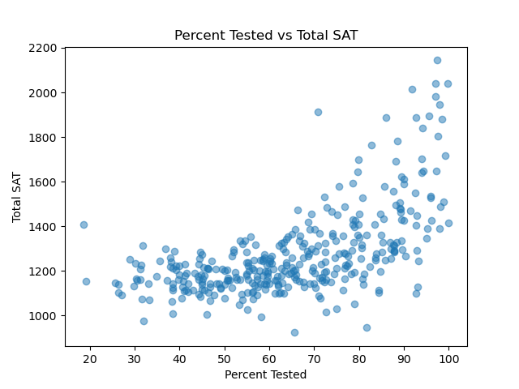

# NYC High Schools SAT Analysis

Exploratory analysis of NYC high school SAT results using pandas, 
analyzing school performance, borough patterns, and 
the relationship between test participation and scores.

## Dataset
`data/schools.csv` — 375 NYC high schools with average SAT scores 
(math/reading/writing) as well as percent of students tested.

## Key Findings
- [  best math school]
- [ Manhattan most inconsistent, Bronx/Brooklyn most consistent but lower-scoring]
- [ moderate-strong positive correlation between percent tested and total SAT]
- [ outlier schools, especially the "International" schools ]

## How to Run
1. Clone this repo
2. `pip install -r requirements.txt`
3. `jupyter notebook analysis.ipynb`

## Tools
Python, pandas, matplotlib